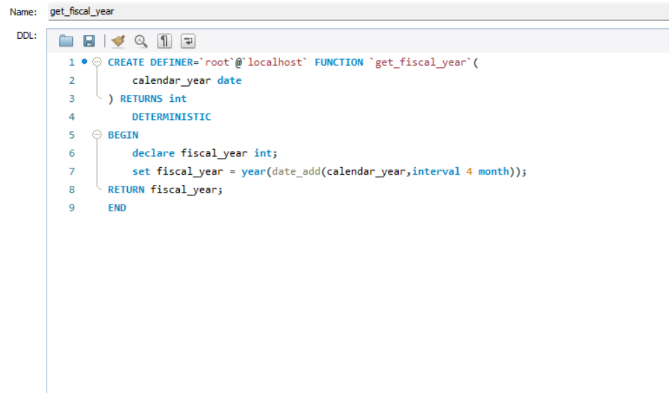
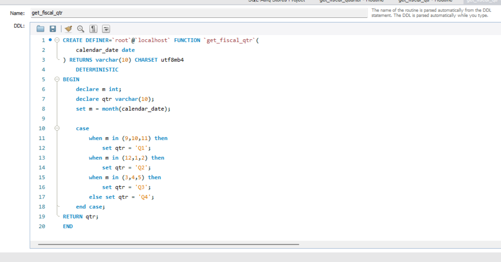
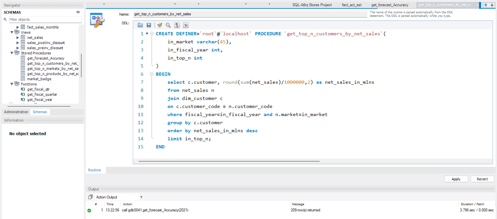
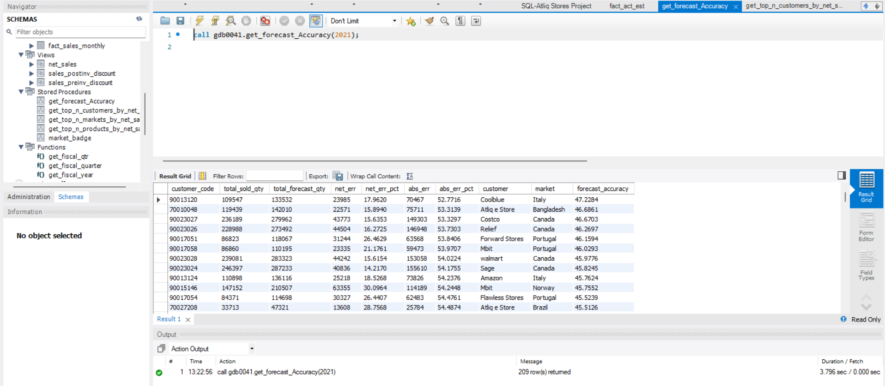
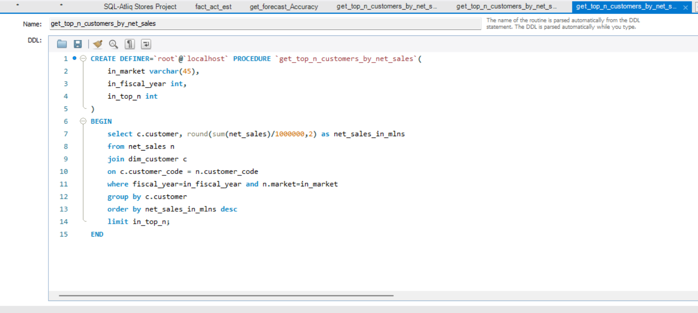
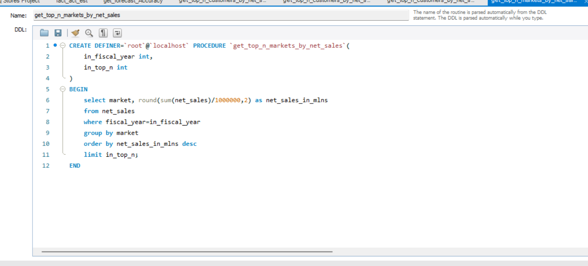
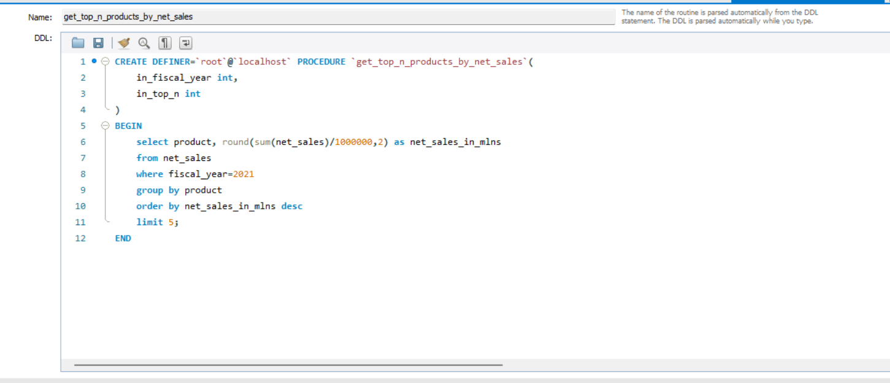
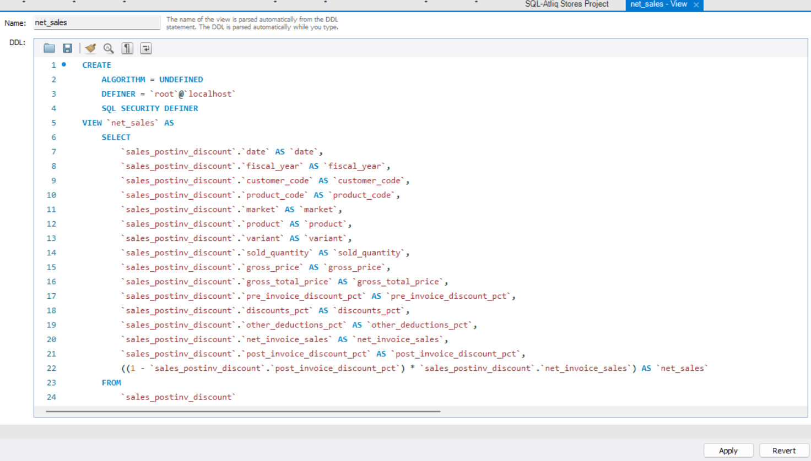
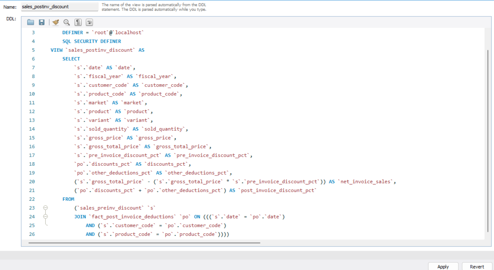
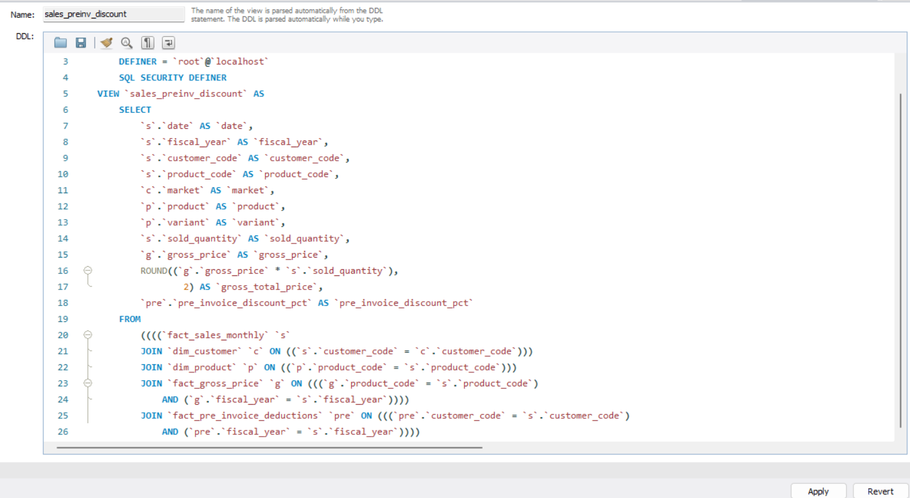

# Atliq-Hardware-SQL-Project

## Objective
Analyzing the dataset of a hardware company to perform finance analytics to find top customers,products,markets and supply chain analytics.

## Overview
This project aims at analyzing the dataset from a company called Atliq Hardware that sells pc, mouse, keyboards, printers,etc to customers. Here comapny has different range of customerrs like Brick & Motar and Online stores.These customers then sell the products to end users. 
The company has 3 channels to sell their products to consumers, these are: 
1. Retailers (which inculde Brick & Motar and Online Stores)
2. Direct Sales : they have their own online stores called AtliQ Direct E-Stores and exclusive showrooms called AtliQ Exclusive showrooms
3. Distributors

## Problem Statement
1. Finance Analytics: To analyze the dataset to find the gross sales report for monthly product transactions, total sales amount, yearly sales report and marlet badge
2. Analyzing the data to find top customers, products and markets
3. Supply Chain Analytics : analzing the data to come up with the forecast accuracy report.

## Key Learning
1. Domain knowledge
2. SQL Joins, Subqueries, CTEs
3. User defined functions: creating function to find fiscal_year and fiscal_quarter
   
   
4. Stored procedures: creating stored procedures for finding forecast_accuracy, top n customers, markets and products by net sales
   
   
   
   
   
5. Database views: creating views for net_sales, post invoice discount sales and pre invoice discount sales
   
   
   
6. Database triggers, events
7. Temporary tables
